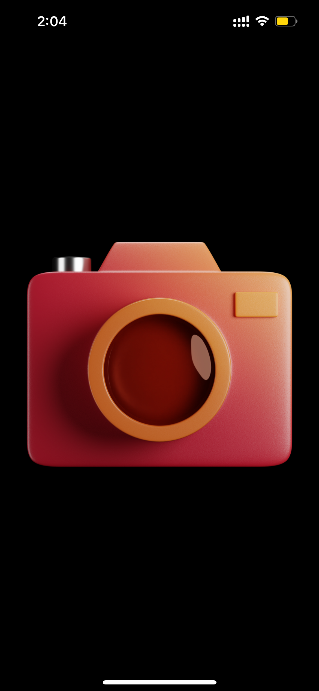
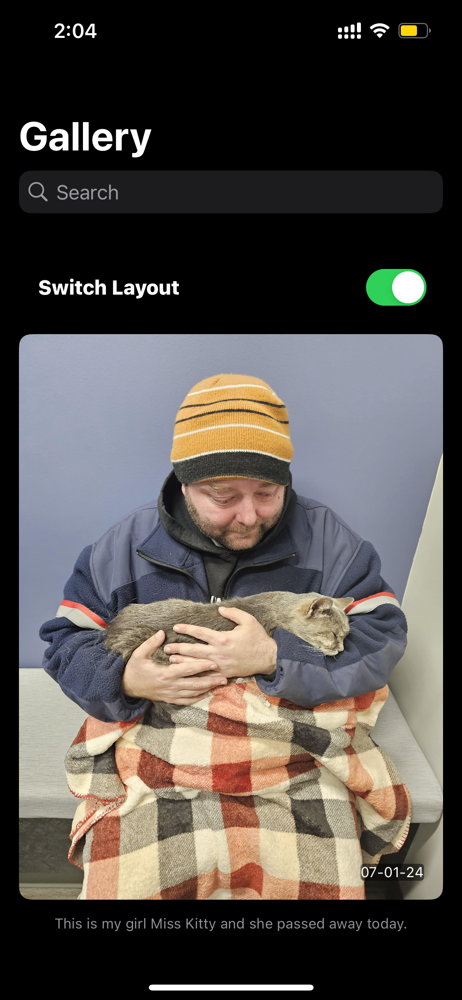
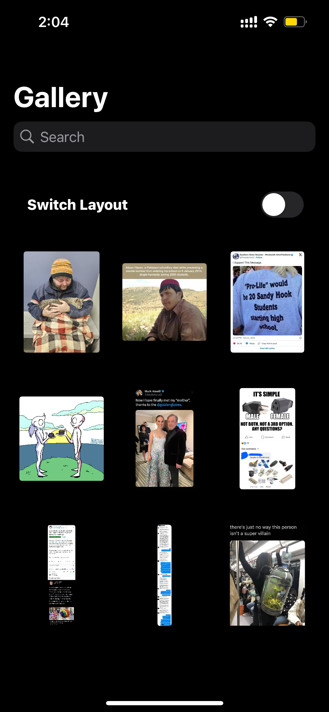
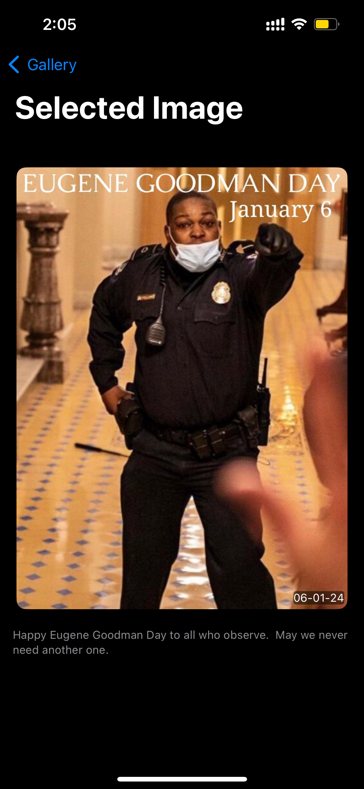

ImgurGallery 

   

This is app contains image gallery wchich fetchs top week images from Imagur.

Steps to run
 * Clone the repo in your local system
 * Run the project in Xcode 15.2 or above

Feautures
  * You can Search the image based on title
  * Download image asynchronous using AsyncImage
  * Toggle between grid and list layout.
